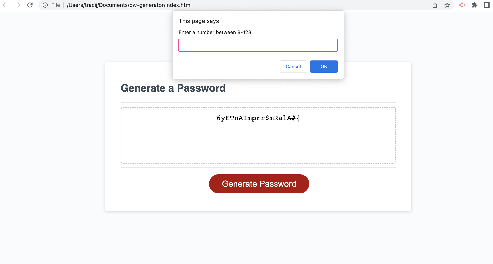

# Password Generator

## Description

- The motivation behind this project was to put my knowledge to the test with Javascript. The task was to use the tools learned in class to create a functioning Password Generator. 
- This project was built to build my skills on the basics of Javascript involving calling functions, variables, alerts and so much more, 
- This web page solves the consumers problem by creating a password for them by just a few clicks. 
- Throughout this project I learned the basics of Javascript. I learned how to call functions, variables, if statments, to create strings and to utilize the console log. 

## Credits (Sited Pages Used)

https://developer.mozilla.org/en-US/docs/Web/JavaScript/Reference/Operators/null

https://www.w3schools.com/js/js_variables.asp

https://developer.mozilla.org/en-US/docs/Web/JavaScript/Reference/Global_Objects/Math/floor

https://developer.mozilla.org/en-US/docs/Web/JavaScript/Reference/Functions/Arrow_functions

https://www.youtube.com/watch?v=duNmhKgtcsI&t=274s

## License

N/A

---
